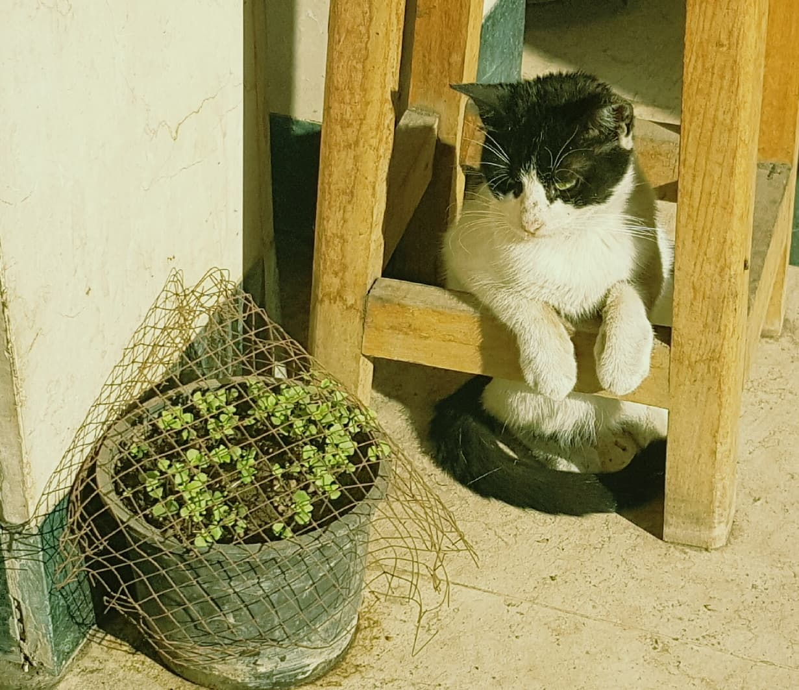

  

 # Werdos: Classifying Internets Weirdest FLOOFs

Playful CNN-powered image classification [interface](https://ammopy.github.io/werdos/) fine-tuned to help your beloved FLOOFs discover their true identity! Integrating [Hugging Face](https://huggingface.co/spaces/AmMoPy/werdoz) and Vercel serverless endpoints for inference and communication.

