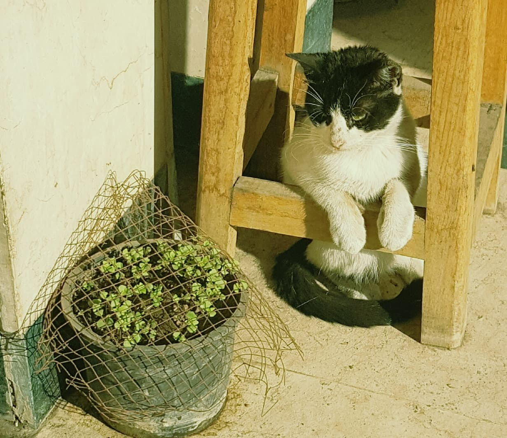

   

# Werdos: Classifying Internets Weirdest Floofs

Will a CNN trained on a small dataset stand the test of accurately identifying your beloved werdo? 

# About:
--------

This [interface](https://ammopy.github.io/werdos/) interacts with two endpoints:

- **Inference**: connecting to Gradio and served by [HF places](https://huggingface.co/spaces/AmMoPy/werdos/tree/main).
- **Form submission**: connecting to EmailJS and served by vercel.

# FunFact:
----------
Fully guided by DeepSeek!
